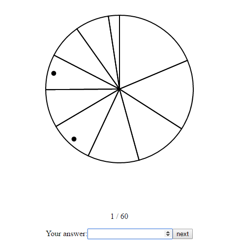
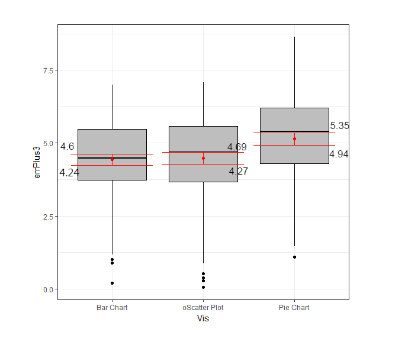

# 582-pro3 --- Yuchen Liu & Qi Wang

## Experiment Interface  
The working link to the experiment:   
Firstly, user choose an id and type into the box and read the instruction (refer to figure1). After clicking the start, the experiment start. The screen will show one of the three kinds of charts: bar chart, pie chart and scatter plot, and an input box. In order to control variables, we use the same color of stroke (black) and width of stroke (2) to draw all the chart. Inside the chart, there is no filling color, and the mark for all three charts is the same small black dot. User should fill in the box with a valid number (0-100) otherwise, the website remove it and ask you to input again. Then user should click “next” button to go to next page. At last page, after user click “next”, an alert message ”congrat, you have finished the experiment” will appear, a table that contains all the experiment record of this user will appears at the bottom and a .csv file that contains this table will be downloaded automatically (refer to figure 2).  
  
Figure 1:      
  
Figure 2:    
  
## Bar Chart (mean error: 4.421512)  
In our experiment, the bar chart achieves the best performance with the minimum mean error: 4.421512. An example bar chart shows below (refer to figure 3).  
  
Figure 3:   
  
## Scatter Plot (mean error: 4.47892)  
In our experiment, the bar chart achieves the second best performance with the mean error: 4.47892. An example scatter plot shows below (refer to figure 4).  
  
Figure 4:  
  
## Pie Chart (mean error:  5.141379)
In our experiment, the bar chart achieves the worst performance with the maximum mean error: 5.141379. An example pie chart shows below (refer to figure 5).  
  
Figure 5:   
  
## Experiment Result  
We calculate the error and log error in Excel Spreadsheet, since the lower bound of log error is -3, we set this to 0. So can we add 3 to each log error.  
  
We use R to draw the following box plot (refer to figure 6). This is a box plot with 0.95 confidence intervals for the mean.  
  
Figure 6:   
  
From this box plot, we can get the ranking of charts. The x axis, from best performance to worst performance, has bar chart, scatter plot and pie chart. The  value of y axis of red lines in each box indicates lower and upper bounds of 0.95 confidence intervals of the log error. The red dot stands for the value of mean. And the bold line stands for the median of log error.  
   
## Technical Achievements 
Learnt how to use D3 to draw different kinds of chart with randomly generated data set, and add random mark for each chart.  
Learnt how to use R to generate box plot to show the Bootstrapped 95\% confidence intervals.  
Learnt the concept of Latin Square.  
    
## Design Achievements   
Learnt how to control the variable.  
Learnt how to add the check for user’s input.  
Learnt how to download html file as .csv file.  
As for Latin Square, we use it to ensure that the 60 trials are counterbalanced. a Latin square consists of n sets of the numbers 1 to n arranged in such a way that no orthogonal (row or column) contains the same number twice. There are total 12 latin squares in order of three, we choose the below 7 latin squares (refer to figure 7), because they contain all the combinations of 1,2 and 3, In our experiment, 1 for pie chart, 2 for scatter plot and 3 for bar chart, then we read them row by row to make a array of size 60 (abandon the last row), and use it as the order of chart.  

Figure 7:   
  

